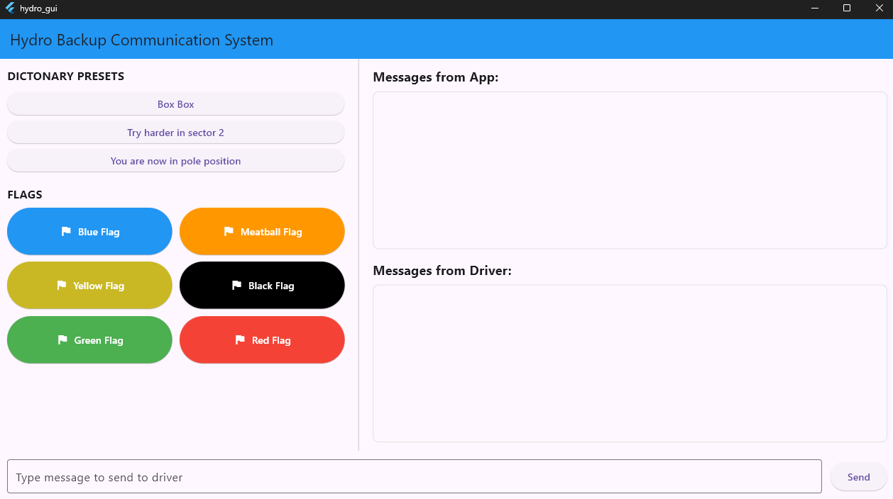

# Hydro GUI - Backup Communication System

A Flutter-based GUI application designed to facilitate communication between the driver and the pit crew.

The application is cross-platform and runs on Linux, Windows, and macOS. It was primarily developed and tested on Linux, including deployment on a Raspberry Pi 4 Model B.



## Quick guide
To run this application, you’ll need to have both Flutter and the backend installed on your system.

To build and run the app on the Raspberry Pi, use the following commands:

```bash
# This will build a linux release version (no debug)
flutter build linux --release

# To run it on the RPI4
./build/linux/arm64/release/bundle/hydro_gui
```

## Features

### Frontend–Backend Connection

The application communicates with the backend via a **Unix socket**.  
It includes an **auto-reconnect** mechanism that attempts to restore the connection up to **10 times**, with **3-second intervals** between retries.

You can find the backend implementation here: [Hydro LoRa Shield Backend](https://github.com/Hydro-backup-Systeem/Hydro-LoRa-Shield.git)

### Driver Communication

Communication with the driver is achieved through two message types: **preset** messages and **custom** typed messages.

- **Preset Messages**  
  Each preset is linked to a specific ID, allowing the Nucleo board to play a corresponding `.wav` file.  
  This ensures clear and fast communication for commonly used phrases.

- **Custom Typed Messages**  
  Users can input their own messages using a text box. These messages are sent as raw text and are spoken aloud via **speech synthesis** on the Nucleo.  
  However, since some messages may not be clearly spoken due to synthesis limitations, presets are preferred for critical communications.

### Types of Messages in Detail

#### Preset Messages

Built-in preset messages are available for quick communication and are accessible from the left panel:

1. "Box Box"
2. "Try harder in sector 2"
3. "You are now in pole position"

#### Preset Flags

Quick-access flag buttons are also available in the left panel for rapid signaling:

1. Blue Flag
2. Meatball Flag  
3. Yellow Flag  
4. Black Flag  
5. Green Flag  
6. Red Flag

#### Custom Messages

A text input field allows you to type and send personalized messages to the driver.  
Messages are sent by clicking the **Send** button.

### Displayed Messages from App and Driver

On the **right-hand side** of the application, there are two panels displaying messages received from the backend:

- **App Messages**  
  These provide system feedback, such as successful connections to the Unix socket or error messages if something goes wrong.

- **Driver Messages**  
  These are the actual messages sent by the driver and received through the backend, allowing you to monitor driver responses in real-time.

### Backend Auto-Start on App Launch

To streamline integration, the Flutter app automatically launches the **LoRa backend executable** when it starts.

>**Note:** You must specify the correct path to the backend executable.  
This path can be configured in the `main.dart` file.

```dart
  Future<void> runLoraExecutable() async { // Function to run the lora executable
    try {
      final process = await Process.start(
        '/home/hydro/project/backend/Hydro-LoRa-Shield/lora', // Path to the lora executable
        [],
        workingDirectory: Directory.current.path,
        runInShell: true,
      );
```
---

## Used Links

[Flutter](https://codelabs.developers.google.com/codelabs/flutter-codelab-first#0)

[Flutter install](https://docs.flutter.dev/get-started/install)

[Flutter guide - setup](https://www.youtube.com/watch?v=1xipg02Wu8s&ab_channel=Fireship)

[Flutter socket](https://pub.dev/packages/socket_io_client)


